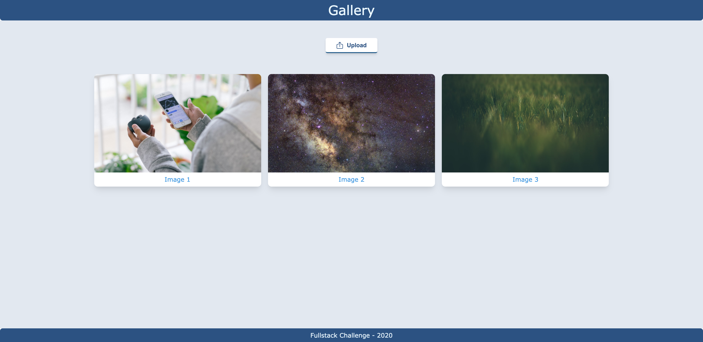
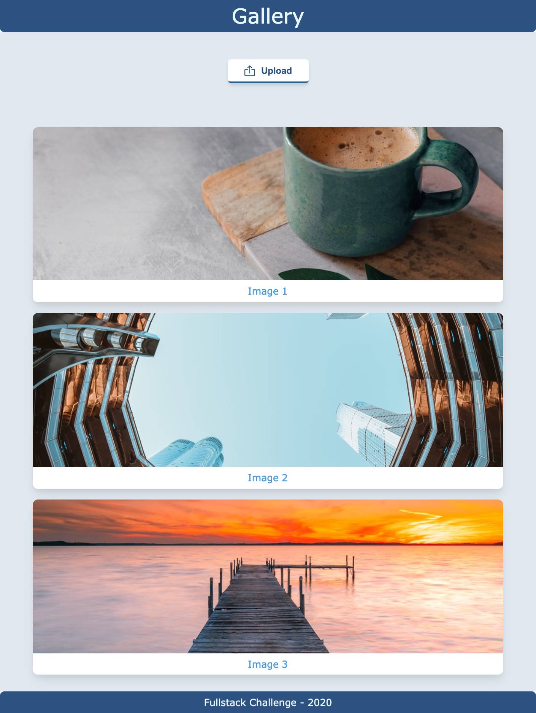

# CCTech June 2020 Full-Stack Hiring Challenge

_This page contains challenges for CCTech's hiring activity for June 2020_

## Job Requirement

- 0-1 year(s) of experience
- Proficient in full-stack development
- BE / B.Tech (CSE or related discipline)

## Candidates are requested to follow these guidelines

- You are expected to write the following program in your preferred language/framework
- Upload your work to your github account and email the link to hr@cctech.co.in
- Record a video demonstrating the workflow of the created website and upload it to YouTube and email the link to hr@cctech.co.in

## Create a full-stack online photo-sharing application named "YouFrame"

### Similar to YouTube, which is for videos, YouFrame is for photos.

#### The application should have the following functionalities:

- Failing to satisfy ANY of the below *Required Criteria*, your application *would probably* be rejected
    - Failing to satisfy Criterias in **bold** of the below *Required Criteria*, your application *will be* be rejected
- The homepage of the website loads a dashboard of all the uploaded photos
- The dashboard contains 3 tiles in a row
- At the top, provide a button to select a photo from your PC and upload it
- On successful upload, this new photo appears at the 1st tile, shifting all other photos by 1 position
- A backend to handle the uploading of images, store the images and list the available image links
- Backend should only allow image file formats

#### Criterias for Evaluation

- Required Criteria
    - User must be able to upload the image through the front-end webpage
    - Non-image files aren't uploadable
    - A grid layout of 3 columns is expected for Desktop displays
    - The uploaded image is viewable in the same webpage in front-end
    - **The Upload Button should have display text 'Upload'**
    - **The Images displayed should have one HTML class of 'preview-image' along with other classes you require**
        - **The id on img tag of each Image should be its file name**
        ```html
        
        ```
    - **Provide documentation to run / view your application**
- Additional / Bonus
    - The Front-End is made using React, or Angular, or TypeScript, or Plaint HTML/CSS/JS
    - The application should try to follow the reference as closely as possible or provide an improved design
    - A single-column layout for Mobile displays
    - Appropriate HTTP response on bad requests
    - It's deployed and publicly accessible. You can use any hosting provider of your choice.

### References for UI

#### Desktop View


#### Mobile View


#### Assets Used 

Colors Used -
- Blue Shades
  - Lightest - #ebf8ff
  - Light - #4299e1
  - Regular - #3182ce
  - Dark - #2c5282

- Gray Shades
  - Light - #e2e8f0
  - Dark - #a0aec0

Fonts
- Verdana

SVG
- [upload.svg](./images/upload.svg)
