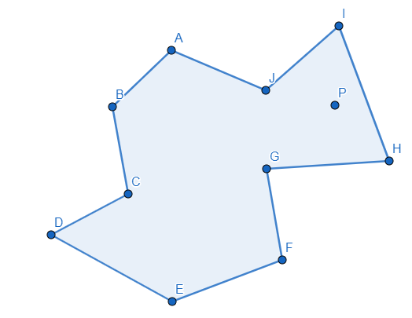

# CCTech June 2020 Software Developer Hiring Challenge

_This page contains challenges for CCTech's hiring activity for June 2020_

## Job Requirement

- 0-1 year(s) of experience
- Proefficient in atleast one language out of C++, C#, JavaScript, Python, Java
- BE / B.Tech (CSE or related discipline)

## Students are requested to follow these guidelines:

- You are expected to write the following programs in your preferred language
- Upload your work to your github account and email the link to hr@cctech.co.in

***

## Program 1 : Check if the given point lies inside or outside a polygon?

**Description**  : Given a polygon and a point **'p'**, find if **'p'** lies inside the polygon or not. The points lying on the border are considered inside.

<table>
    <tr>
        <td></td>
        <td></td>
    </tr>
</table>

#### Write a function that takes two arguments as a input and return **_True_** if **'p'** lies inside the polygon else **_False_**.   Do not use any built-in or library functions. This question is to test you ability to create the required algorithm.   

**Input 1** : array consisting the coordinates of polygon in 2-D  
**Input 2** : coordinated of points in 2-D  
**Output** : **_True_** if point 'p' lies inside the polygon else **_False_**  

**Example :** 

- **Case 1 :**
    - Input -
        - $ Polygon$ : $ [[1,0], [8,3], [8,8], [1,5]]  $
        - $ P $:  $ [3,5] $ 
        - Output : **True**    
        

- **Case 2 :**
    - input
        - $ Polygon $ : $ [[-3,2], [-2,-0.8], [0,1.2], [2.2,0], [2,4.5]]$
        - $ P $ : $[0,0]$
        - Output : **False**

***
## Question 2 : Calculate the surface of the building exposed to sunlight?

**Description**  : Given a coordinates of buildings and source point **_'p'_** of sunlight. Calculate the length of building exposed to sunlight having the source at point **_p_**.

 

#### Write a function that takes two arguments as a input and return **length** of the building exposed to sunlight  

**Input 1** : $(n*4*2)$ array consisting the coordinates of n buildings in 2-D, where n is number of buildings  
**Input 2** : coordinated of source of light in 2-D  
**Output** : (float) Length of surface exposed to sunlight

**Example :** 

- Case 1
    - Input -
        - $ Buildings Coordinates$ : $ [[[4,0],[4,-5],[7,-5],[7,0]]]  $
        - $ S $:  $ [1,1] $ 
        - Output : **8.0**    
        

- Case 1
    - input
        - $ Buildings Coordinates$ : $ [[[4,0],[4,-5],[7,-5],[7,0]], [[0.4,-2],[0.4,-5],[2.5,-5],[2.5,-2]]]  $
        - $ S $:  $ [-3.5,1] $ 
        - Output : **to be calculated**    